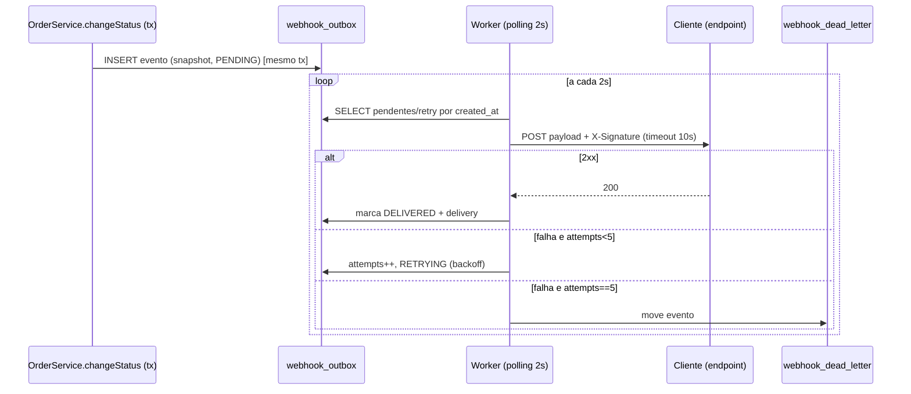

# FDD: Sistema de Webhooks de Notificação de Pedidos

Versão: 1.0 · Data: 2026-07-03 · Responsável: Eloi Gonçalves

## 1. Contexto e motivação técnica

Clientes B2B (Atlas Comercial, MaxDistribuição e Nova Cargo) precisam ser notificados quando o status de seus pedidos muda, em vez de fazer polling no `GET /orders` (`[09:00] Marcos`). A solução é um sistema de webhooks outbound baseado em outbox transacional no MySQL, consumido por um worker separado em polling, com retry/backoff, DLQ, assinatura HMAC-SHA256 e garantia at-least-once. As decisões de fundo estão nos ADRs; este documento descreve como implementar. O ponto de integração crítico é `changeStatus` em `src/modules/orders/order.service.ts`, cuja transação passa a gravar o evento na outbox (`[09:40] Bruno`, `[09:41] Diego`).

## 2. Objetivos técnicos

| Objetivo | Medida / invariante |
| --- | --- |
| Notificação quase em tempo real | Latência de entrega abaixo de 10s para cliente saudável; polling de 2s dá piso de ~2s (`[09:10] Larissa`) |
| Consistência com a mudança de status | Invariante: evento existe se e somente se a transação de status commitou (outbox no mesmo `tx`) (`[09:06] Diego`) |
| Entrega confiável | at-least-once garantido; nenhuma perda silenciosa; falhas terminais vão para a DLQ (`[09:24] Diego`) |
| Segurança da entrega | 100% das entregas assinadas com HMAC-SHA256 e secret por endpoint (`[09:20] Sofia`) |
| Resiliência a indisponibilidade do cliente | 5 tentativas cobrindo janela de ~15h antes da DLQ (`[09:17] Diego`) |

## 3. Escopo e exclusões

**Incluído:** CRUD de configuração de webhook, filtro de eventos por status, histórico de deliveries, geração e rotação de secret, emissão transacional na outbox, worker de entrega com retry/backoff, DLQ com replay admin, entrega assinada.

**Excluído (fora de escopo/adiado):**
- Notificação por email quando o webhook do cliente falha, adiado para a próxima fase (`[09:37] Larissa`, `[09:38] Marcos`).
- Rate limiting de saída, adiado para observar e decidir depois (`[09:38] Diego`, `[09:39] Larissa`).
- Dashboard/painel visual para o cliente, projeto do time de frontend (`[09:39] Marcos`, `[09:40] Larissa`).
- Ordering global / múltiplos workers em paralelo, limitação conhecida (`[09:12] Diego`, `[09:13] Larissa`).
- Webhooks inbound (cliente para nós), descartado (`[09:02] Sofia`, `[09:02] Marcos`).

## 4. Fluxos detalhados

### 4.1 Criação do evento na outbox (dentro da transação de changeStatus)
1. `changeStatus` abre `this.prisma.$transaction(async (tx) => { ... })` em `src/modules/orders/order.service.ts`.
2. Valida transição via `canTransition` (`src/modules/orders/order.status.ts`), atualiza estoque quando aplicável.
3. `tx.order.update(...)` grava o novo `status`.
4. `tx.orderStatusHistory.create(...)` registra a auditoria da transição.
5. Chama `publishWebhookEvent(tx, order, fromStatus, toStatus)`: consulta se algum webhook do `customer` quer o `toStatus`; se nenhum quiser, não insere nada (filtro na inserção, `[09:34] Bruno`).
6. Para cada webhook interessado, renderiza o snapshot do payload e insere uma linha em `webhook_outbox` com `event_id` (UUID), `status = PENDING` e o payload materializado (`[09:52] Diego`).
7. Se a inserção falhar, a exceção propaga e a transação inteira dá rollback (`[09:40] Bruno`).
8. `tx.order.findUnique(...)` relê o estado final e retorna.

### 4.2 Processamento pelo worker (polling 2s)
1. `src/worker.ts` inicializa um PrismaClient próprio e entra em loop.
2. A cada 2s, seleciona em batch as linhas `PENDING` (e as `RETRYING` cujo `next_attempt_at <= now`) ordenadas por `created_at`.
3. Marca a linha como `PROCESSING`.
4. Monta os headers (`X-Event-Id`, `X-Signature`, `X-Timestamp`, `X-Webhook-Id`, `Content-Type`) e faz `POST` na `url` do endpoint com timeout de 10s (`[09:42] Diego`).
5. Em `2xx`: marca `DELIVERED` e grava um registro de delivery (sucesso, status HTTP, tempo de resposta).
6. Em falha (timeout, erro de rede, status não 2xx): registra a tentativa e aplica o backoff (fluxo 4.3).

### 4.3 Retry com backoff (1m/5m/30m/2h/12h)
1. Incrementa `attempts` da linha.
2. Se `attempts < 5`: calcula `next_attempt_at = now + offset[attempts]`, onde `offset = [1m, 5m, 30m, 2h, 12h]`, e marca `RETRYING` (`[09:17] Diego`).
3. Grava um registro de delivery com o resultado da tentativa (falha, status HTTP/erro, tempo).
4. Se `attempts == 5` e ainda falhou: aciona o fluxo 4.4 (DLQ).

### 4.4 Movimentação para a DLQ e replay manual
1. Insere o evento em `webhook_dead_letter` com payload, motivo da falha e timestamp (`[09:18] Diego`).
2. Remove/encerra a linha correspondente na outbox.
3. Replay manual: `POST /admin/webhooks/dead-letter/:id/replay` (role ADMIN) recoloca o evento na `webhook_outbox` como `PENDING` e loga quem executou, para auditoria (`[09:35] Diego`, `[09:36] Sofia`).



## 5. Contratos públicos

Todos os endpoints de configuração exigem `authenticate`; o replay exige `requireRole('ADMIN')` (`src/middlewares/auth.middleware.ts`).

### 5.1 POST /webhooks (cadastro; retorna secret gerada)
Request:
```http
POST /api/v1/webhooks
Authorization: Bearer <jwt>
Content-Type: application/json

{
  "customerId": "e3b0c442-98fc-4c14-9af5-1b2c3d4e5f60",
  "url": "https://atlas.example.com/hooks/orders",
  "subscribedStatuses": ["SHIPPED", "DELIVERED"]
}
```
Response `201 Created` (a `secret` só aparece na criação):
```json
{
  "id": "9f1a7c2e-5b3d-4a6f-8e21-0c9d8b7a6f54",
  "customerId": "e3b0c442-98fc-4c14-9af5-1b2c3d4e5f60",
  "url": "https://atlas.example.com/hooks/orders",
  "subscribedStatuses": ["SHIPPED", "DELIVERED"],
  "secret": "whsec_2b1c9d8e7f6a5b4c3d2e1f0a9b8c7d6e",
  "active": true,
  "createdAt": "2026-07-03T12:00:00.000Z"
}
```
Status: `201` criado; `400` `WEBHOOK_INVALID_URL` (url não `https`); `422` `WEBHOOK_PAYLOAD_TOO_LARGE` não se aplica aqui; `401` sem token.

### 5.2 GET /webhooks?customerId=... e GET /webhooks/:id
Request:
```http
GET /api/v1/webhooks?customerId=e3b0c442-98fc-4c14-9af5-1b2c3d4e5f60
Authorization: Bearer <jwt>
```
Response `200 OK` (secret nunca é retornada em leitura):
```json
{
  "data": [
    {
      "id": "9f1a7c2e-5b3d-4a6f-8e21-0c9d8b7a6f54",
      "customerId": "e3b0c442-98fc-4c14-9af5-1b2c3d4e5f60",
      "url": "https://atlas.example.com/hooks/orders",
      "subscribedStatuses": ["SHIPPED", "DELIVERED"],
      "active": true
    }
  ],
  "pagination": { "page": 1, "pageSize": 20, "total": 1 }
}
```
Status: `200` ok; `404` `WEBHOOK_NOT_FOUND` (em `GET /webhooks/:id` inexistente); `401` sem token.

### 5.3 PATCH /webhooks/:id e DELETE /webhooks/:id
Request:
```http
PATCH /api/v1/webhooks/9f1a7c2e-5b3d-4a6f-8e21-0c9d8b7a6f54
Authorization: Bearer <jwt>
Content-Type: application/json

{ "subscribedStatuses": ["DELIVERED"], "active": false }
```
Response `200 OK`:
```json
{
  "id": "9f1a7c2e-5b3d-4a6f-8e21-0c9d8b7a6f54",
  "url": "https://atlas.example.com/hooks/orders",
  "subscribedStatuses": ["DELIVERED"],
  "active": false
}
```
`DELETE /api/v1/webhooks/:id` responde `204 No Content`.
Status: `200`/`204` ok; `404` `WEBHOOK_NOT_FOUND`; `400` `WEBHOOK_INVALID_URL` se a url for alterada para não `https`; `401` sem token.

### 5.4 GET /webhooks/:id/deliveries (histórico de entregas)
Request:
```http
GET /api/v1/webhooks/9f1a7c2e-5b3d-4a6f-8e21-0c9d8b7a6f54/deliveries
Authorization: Bearer <jwt>
```
Response `200 OK`:
```json
{
  "data": [
    {
      "id": "6d5c4b3a-2f1e-0d9c-8b7a-6f5e4d3c2b1a",
      "eventId": "1b2c3d4e-5f60-7a8b-9c0d-1e2f3a4b5c6d",
      "status": "DELIVERED",
      "httpStatus": 200,
      "responseTimeMs": 143,
      "attempt": 1,
      "createdAt": "2026-07-03T12:00:03.000Z"
    }
  ],
  "pagination": { "page": 1, "pageSize": 20, "total": 1 }
}
```
Status: `200` ok; `404` `WEBHOOK_NOT_FOUND`; `401` sem token.

### 5.5 POST /webhooks/:id/rotate-secret (rotação com grace 24h)
Request:
```http
POST /api/v1/webhooks/9f1a7c2e-5b3d-4a6f-8e21-0c9d8b7a6f54/rotate-secret
Authorization: Bearer <jwt>
```
Response `200 OK` (a secret antiga permanece válida por 24h):
```json
{
  "secret": "whsec_7d6e5f4a3b2c1d0e9f8a7b6c5d4e3f2a",
  "previousSecretValidUntil": "2026-07-04T12:00:00.000Z"
}
```
Status: `200` ok; `404` `WEBHOOK_NOT_FOUND`; `401` sem token.

### 5.6 POST /admin/webhooks/dead-letter/:id/replay (role ADMIN)
Request:
```http
POST /api/v1/admin/webhooks/dead-letter/6d5c4b3a-2f1e-0d9c-8b7a-6f5e4d3c2b1a/replay
Authorization: Bearer <jwt-admin>
```
Response `202 Accepted`:
```json
{ "outboxId": "0a1b2c3d-4e5f-6a7b-8c9d-0e1f2a3b4c5d", "status": "PENDING" }
```
Status: `202` recolocado na outbox; `403` `FORBIDDEN` (role não ADMIN); `404` `WEBHOOK_NOT_FOUND` (item de DLQ inexistente); `401` sem token.

### 5.7 Request OUTBOUND enviado ao cliente pelo worker
```http
POST https://atlas.example.com/hooks/orders
Content-Type: application/json
X-Event-Id: 1b2c3d4e-5f60-7a8b-9c0d-1e2f3a4b5c6d
X-Signature: sha256=4f3e2d1c0b9a8f7e6d5c4b3a2f1e0d9c8b7a6f5e4d3c2b1a0f9e8d7c6b5a4f3e
X-Timestamp: 2026-07-03T12:00:02.000Z
X-Webhook-Id: 9f1a7c2e-5b3d-4a6f-8e21-0c9d8b7a6f54

{
  "event_id": "1b2c3d4e-5f60-7a8b-9c0d-1e2f3a4b5c6d",
  "event_type": "order.status_changed",
  "timestamp": "2026-07-03T12:00:00.000Z",
  "order_id": "a1b2c3d4-e5f6-7a8b-9c0d-1e2f3a4b5c6d",
  "order_number": "ORD-2026-000123",
  "from_status": "PROCESSING",
  "to_status": "SHIPPED",
  "customer_id": "e3b0c442-98fc-4c14-9af5-1b2c3d4e5f60",
  "total_cents": 158900
}
```
O `X-Signature` é o HMAC-SHA256 do corpo bruto usando a secret do endpoint (`[09:20] Sofia`, `[09:44] Diego`). O cliente deve deduplicar pelo `X-Event-Id` (`[09:25] Diego`).

## 6. Matriz de erros (códigos WEBHOOK_*)

| Código | HTTP status | Condição | Tratamento |
| --- | --- | --- | --- |
| `WEBHOOK_NOT_FOUND` | 404 | Webhook ou item de DLQ inexistente | Estende `NotFoundError`; serializado pelo error middleware |
| `WEBHOOK_INVALID_URL` | 400 | URL não `https` no cadastro/edição | Estende `ValidationError`; validação no schema Zod (`[09:23] Sofia`) |
| `WEBHOOK_SECRET_REQUIRED` | 400 | Operação que exige secret sem secret configurada | Estende `ValidationError` |
| `WEBHOOK_PAYLOAD_TOO_LARGE` | 422 | Payload do evento acima de 64KB | Estende `UnprocessableEntityError`; erro, não trunca (`[09:23] Sofia`) |
| `WEBHOOK_DELIVERY_FAILED` | 502 | Falha de entrega registrada em contexto síncrono | Estende `AppError`; usado em replay síncrono/diagnóstico |

Todos os códigos usam o prefixo `WEBHOOK_` e são serializados sem alteração pelo `errorMiddleware` (`src/middlewares/error.middleware.ts`).

## 7. Estratégias de resiliência

- Timeout HTTP de 10s por tentativa; cliente que não responde a tempo é tratado como falha (`[09:42] Diego`).
- 5 tentativas com backoff exponencial 1m/5m/30m/2h/12h (`[09:17] Diego`).
- Ao esgotar as tentativas, o evento vai para `webhook_dead_letter` (`[09:18] Diego`).
- Sem rollback da mudança de status por falha de entrega: a transação de status já commitou; a entrega é assíncrona e independente (`[09:06] Diego`).
- Snapshot do payload na inserção garante que a entrega reflete o estado do momento da mudança, mesmo após horas de retry (`[09:52] Larissa`).

## 8. Observabilidade

- **Métricas:** `webhook_deliveries_total` (por resultado), `webhook_retry_total`, `webhook_dlq_total` e latência de entrega (histograma do tempo de resposta do `POST` outbound).
- **Logs estruturados via Pino** (`src/shared/logger/index.ts`): campos `event_id`, `webhook_id`, `attempt`, `http_status`, `response_time_ms`, `result`; `redactPaths` protege `secret` e `X-Signature` para não vazar em log (`[09:29] Bruno`).
- **Tracing:** spans no worker cobrindo a leitura do batch, o envio HTTP e a persistência do resultado, correlacionados por `event_id`.

## 9. Dependências e compatibilidade

- Prisma/MySQL existente; nenhuma infraestrutura nova (`[09:07] Diego`).
- Novas tabelas: `webhook_config` (endpoint + secret + `customer_id` + status), `webhook_outbox`, `webhook_dead_letter`, `webhook_delivery`, todas com `@default(uuid())` seguindo o padrão de `prisma/schema.prisma` (`[09:51] Larissa`).
- Nenhuma lib nova além do módulo `crypto` nativo do Node para o HMAC-SHA256 (`[09:20] Sofia`).

## 10. Critérios de aceite técnicos

- [ ] Inserção na `webhook_outbox` ocorre dentro da transação do `changeStatus`; falha na inserção causa rollback.
- [ ] Worker separado (`src/worker.ts`) processa pendentes em polling de 2s com PrismaClient próprio.
- [ ] Retry aplica exatamente 1m/5m/30m/2h/12h e move para DLQ após a 5ª falha.
- [ ] Toda entrega inclui `X-Event-Id`, `X-Signature` (HMAC-SHA256), `X-Timestamp`, `X-Webhook-Id`.
- [ ] Cadastro recusa URL não `https` com `WEBHOOK_INVALID_URL`.
- [ ] Payload acima de 64KB gera `WEBHOOK_PAYLOAD_TOO_LARGE`.
- [ ] Rotação de secret mantém a antiga válida por 24h.
- [ ] Replay da DLQ exige role ADMIN e registra quem executou.

## 11. Riscos e mitigação

| Risco | Mitigação |
| --- | --- |
| Acúmulo de linhas na outbox degrada o worker | Índices em estado e `created_at`; leitura em batch pequeno; arquivamento futuro (`[09:08] Diego`) |
| Vazamento de secret do cliente | Secret por endpoint, rotação com grace de 24h, `redact` no logger (`[09:21] Sofia`) |
| Regressão na transação de status | Testes ponta a ponta e revisão de segurança da Sofia antes do deploy (`[09:46] Sofia`) |
| Entregas fora de ordem ao escalar | Manter single-worker por enquanto; particionar por `order_id` no futuro (`[09:13] Diego`) |

## 12. Integração com o sistema existente (OBRIGATÓRIA)

| Arquivo real | Como integrar |
| --- | --- |
| `src/modules/orders/order.service.ts` | Estender `changeStatus` para chamar `publishWebhookEvent(tx, order, fromStatus, toStatus)` dentro do `this.prisma.$transaction`, após `tx.orderStatusHistory.create` e antes do `refreshed`; se a inserção na outbox falhar, rollback (`[09:40] Bruno`, `[09:41] Diego`) |
| `src/modules/orders/order.status.ts` | Fonte da verdade das transições (`transitions`, `canTransition`); define quais mudanças de status disparam eventos (ex.: `SHIPPED → DELIVERED`) e alimenta o filtro por endpoint |
| `src/shared/errors/http-errors.ts` e `src/shared/errors/app-error.ts` | Criar `WebhookNotFoundError`, `WebhookInvalidUrlError` etc. estendendo `AppError`/`NotFoundError`/`ValidationError`, seguindo o padrão de `InvalidStatusTransitionError` e `InsufficientStockError`, com códigos `WEBHOOK_*` |
| `src/middlewares/error.middleware.ts` | Sem alteração: já converte `AppError`/`ZodError`/erros Prisma em `{ error: { code, message, details } }`; os erros `WEBHOOK_*` fluem direto (`[09:29] Bruno`) |
| `src/middlewares/auth.middleware.ts` | Reusar `authenticate` no CRUD e `requireRole('ADMIN')` no endpoint de replay da DLQ (`[09:36] Larissa`) |
| `src/shared/logger/index.ts` | Reusar o `logger` Pino e `redactPaths`; garantir redaction de `secret` e `X-Signature` (`[09:29] Bruno`) |
| `src/server.ts` e `src/app.ts` | Molde para o novo `src/worker.ts` (processo separado, PrismaClient próprio, graceful shutdown); registrar rotas de webhooks no `/api/v1` via `buildApp` |
| `prisma/schema.prisma` | Novos models `webhook_config`, `webhook_outbox`, `webhook_dead_letter`, `webhook_delivery` seguindo `@id @default(uuid()) @db.Char(36)` |

Confirmação de existência dos arquivos citados na seção 12 (todos verificados no repositório):
- `src/modules/orders/order.service.ts`: existe.
- `src/modules/orders/order.status.ts`: existe.
- `src/shared/errors/http-errors.ts`: existe.
- `src/shared/errors/app-error.ts`: existe.
- `src/middlewares/error.middleware.ts`: existe.
- `src/middlewares/auth.middleware.ts`: existe.
- `src/shared/logger/index.ts`: existe.
- `src/server.ts`: existe.
- `src/app.ts`: existe.
- `prisma/schema.prisma`: existe.
