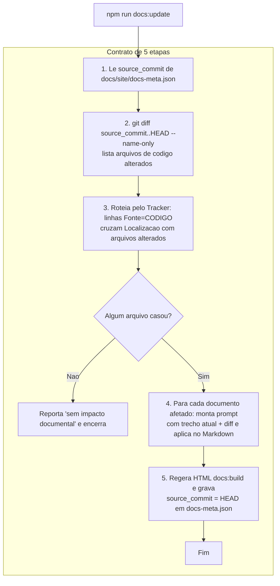
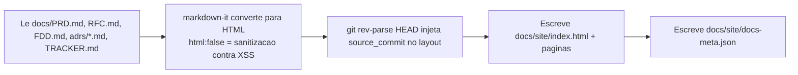

# Plano da Documentação Viva (Fase 2)

> Projeto do mecanismo que renderiza os design docs em HTML, ancora a documentacao a um commit e atualiza apenas o que o codigo alterado impacta, direcionado pelo Tracker. Este documento e apenas o plano; os scripts sao implementados nos prompts de execucao seguintes.

## 1. Visao geral do mecanismo

O mecanismo tem dois pontos de entrada: `docs:build` (gera o HTML + `docs-meta.json`) e `docs:update` (auto-atualizacao direcionada em 5 etapas). O `docs:update` reusa o `docs:build` na etapa 5.



Fluxo do `docs:build` (isolado):



## 2. Estrutura de arquivos do tooling

```
tools/docs/
  lib.mjs             # helpers compartilhados: git, parser do Tracker, lista de documentos
  generate-html.mjs   # Artefato 1 + 2: gera docs/site/*.html e docs-meta.json (docs:build)
  update-docs.mjs     # Artefato 3: auto-update direcionado de 5 etapas (docs:update)
  template.mjs        # layout HTML (sidebar navegavel + cabecalho com hash do commit)
  README.md           # comando exato e contrato do mecanismo

docs/site/
  index.html          # capa + indice navegavel
  prd.html, rfc.html, fdd.html, tracker.html
  adrs/index.html + adrs/ADR-00N-*.html
  styles.css
  docs-meta.json      # Artefato 2

docs/_work/
  plano-doc-viva.md          # este plano
  update-prompts/*.md        # prompts direcionados gerados pela etapa 4 (quando ha impacto)

package.json (scripts adicionados):
  "docs:build":  "node tools/docs/generate-html.mjs"
  "docs:update": "node tools/docs/update-docs.mjs"
```

Dependencia nova (unica): `markdown-it` em `devDependencies`. Justificativa no item 6.

## 3. Contrato do `docs-meta.json`

Tres campos obrigatorios. Exemplo preenchido:

```json
{
  "source_commit": "492dd85b257b61fe7a89475453bd96b0abf1bd44",
  "generated_at": "2026-07-06T12:00:00.000Z",
  "documents": ["docs/PRD.md", "docs/RFC.md", "docs/FDD.md", "docs/adrs/", "docs/TRACKER.md"]
}
```

- `source_commit`: hash completo do HEAD no momento da geracao (`git rev-parse HEAD`). E a ancora de sincronizacao.
- `generated_at`: timestamp ISO 8601 (`new Date().toISOString()`).
- `documents`: os cinco documentos cobertos pelo site.

## 4. Roteamento pelo Tracker (etapa 3, o diferencial)

O parser le `docs/TRACKER.md`, isola a tabela markdown, e para cada linha extrai as colunas `ID`, `Documento`, `Fonte` e `Localizacao`. Mantem **apenas** as linhas com `Fonte = CODIGO`. Cada uma vira uma entrada de roteamento:

```
{ id, documento, arquivoCodigo (= Localizacao), }
```

Na etapa 2 obtemos a lista de arquivos alterados (`git diff --name-only`). O roteador cruza cada arquivo alterado com a coluna `Localizacao` das linhas `CODIGO`. Quando ha match, agrupa por `Documento` e produz:

```
{ documento, ids: [...], arquivos: [...], diff: <git diff do arquivo> }
```

Linhas `Fonte = TRANSCRICAO` sao ignoradas (nao tem origem em codigo, logo nao reagem a `git diff`).

### Exemplo concreto

Alteracao em `src/modules/orders/order.status.ts`. As linhas `CODIGO` do Tracker atuais sao:

| ID | Documento | Localizacao |
| --- | --- | --- |
| PRD-RNF-05 | docs/PRD.md | src/shared/logger/index.ts |
| FDD-INT-01 | docs/FDD.md | src/modules/orders/order.service.ts |
| **FDD-INT-02** | **docs/FDD.md** | **src/modules/orders/order.status.ts** |
| FDD-INT-03 | docs/FDD.md | src/shared/errors/http-errors.ts |
| FDD-INT-04 | docs/FDD.md | src/middlewares/error.middleware.ts |
| FDD-INT-05 | docs/FDD.md | src/middlewares/auth.middleware.ts |
| FDD-INT-06 | docs/FDD.md | src/server.ts |
| FDD-INT-07 | docs/FDD.md | prisma/schema.prisma |
| FDD-OBS-01 | docs/FDD.md | src/shared/logger/index.ts |
| ADR-006 | docs/adrs/ADR-006-reuso-padroes-do-projeto.md | src/shared/errors/app-error.ts |

O unico match para `src/modules/orders/order.status.ts` e a linha **FDD-INT-02 -> docs/FDD.md**. Resultado do roteamento:

```
{ documento: "docs/FDD.md", ids: ["FDD-INT-02"], arquivos: ["src/modules/orders/order.status.ts"], diff: <diff da maquina de estados> }
```

Ou seja: uma mudanca na maquina de estados so dispara atualizacao do FDD (e, via a mesma linha, dos trechos que descrevem as transicoes/o ADR da maquina de estados quando referenciado). Nenhum outro documento e tocado. Isso e o update direcionado, nao regeneracao cega. Se o mesmo commit tambem tocasse `src/shared/logger/index.ts`, o roteador adicionaria `docs/PRD.md` (PRD-RNF-05) e mais itens do FDD (FDD-OBS-01).

## 5. Estrategia da etapa 4 (IA)

A integracao de IA e **assistida (prompt gerado + humano/agente aplica)**, para manter o mecanismo reproduzivel e sem exigir chave de API commitada.

- **Contrato de entrada** (o que o script monta por documento afetado):
  - caminho do documento,
  - IDs do Tracker afetados,
  - trecho atual do documento (o Markdown alvo),
  - diff do(s) arquivo(s) de codigo,
  - instrucao: alterar apenas os trechos impactados, preservar estilo e rastreabilidade.
- **Contrato de saida:** Markdown atualizado apenas nos trechos afetados.
- **Invocacao:** `npm run docs:update` (sem flag) executa etapas 1 a 4-preparacao: roteia e **grava um prompt direcionado por documento** em `docs/_work/update-prompts/<doc>.md`, e pausa. O operador (a IA, neste desafio) aplica as edicoes nos Markdown e reexecuta `npm run docs:update -- --apply`, que executa a etapa 5 (regera HTML + re-ancora `docs-meta.json`). Se `source_commit == HEAD` ou nenhum arquivo casar com o Tracker, reporta "sem impacto documental" e nao gera prompts.

Template do prompt (embutido no script):

```
Voce esta atualizando UM design doc para refletir uma mudanca de codigo.
NAO reescreva o documento inteiro. Altere apenas os trechos impactados.

Documento: {caminho}
Itens do Tracker afetados: {IDs}
Trecho atual do documento:
---
{trecho}
---
Diff do codigo ({arquivo}):
---
{diff}
---
Regra: mantenha o estilo e a rastreabilidade. Produza apenas o trecho atualizado.
```

## 6. Comandos exatos

| Comando | O que faz |
| --- | --- |
| `npm run docs:build` | Gera `docs/site/` (HTML navegavel dos 5 documentos, com hash do commit visivel) e `docs/site/docs-meta.json`. Reproduzivel: roda do zero. |
| `npm run docs:update` | Etapas 1 a 4: le a ancora, calcula o diff, roteia pelo Tracker e emite os prompts direcionados em `docs/_work/update-prompts/`. Reporta "sem impacto documental" quando `source_commit == HEAD`. |
| `npm run docs:update -- --apply` | Etapa 5: apos as edicoes de Markdown, regera o HTML e grava `source_commit = HEAD` + novo `generated_at`. |

### Escolhas registradas

1. **Gerador de HTML:** `markdown-it` + template HTML proprio (uma pagina por documento + sidebar). Dependencia unica, madura e com `html: false` por padrao (escapa HTML embutido -> mitiga XSS sem lib extra de sanitizacao). SSG completo seria excessivo.
2. **Onde vive o tooling:** `tools/docs/` (fora de `src/`), com scripts `.mjs` ESM (o projeto ja e `"type": "module"`). Nao e codigo da aplicacao.
3. **Hash no HTML:** `git rev-parse HEAD` no momento da geracao, injetado no cabecalho/rodape de todas as paginas e gravado em `docs-meta.json` (mesma fonte, garante igualdade).
4. **Parser do Tracker:** le a tabela markdown de `docs/TRACKER.md`, filtra `Fonte = CODIGO`, extrai `Localizacao` como caminho de codigo e agrupa por `Documento`.
5. **Chamada de IA (etapa 4):** assistida via prompts gerados; aplicacao pelo operador; etapa 5 com `--apply`. Sem chave de API no repo.
6. **Seguranca:** nenhum segredo commitado; se futuramente usar API de IA, chave lida de variavel de ambiente. `markdown-it` com `html:false` evita XSS a partir de HTML embutido nos Markdown.

## Autoverificacao

- [x] O plano cobre as 5 etapas exatas do contrato do enunciado.
- [x] A etapa 3 (roteamento pelo Tracker) esta clara e exemplificada (`order.status.ts` -> FDD-INT-02 -> docs/FDD.md).
- [x] O HTML previsto exibe o hash do commit e cobre os 5 documentos (PRD, RFC, FDD, ADRs, Tracker).
- [x] Dependencia minima (`markdown-it`) e reprodutivel.
- [x] Nenhuma alteracao de codigo de aplicacao prevista (so tooling em `tools/docs/` e `docs/site/`).
- [x] Salvo em `docs/_work/plano-doc-viva.md`.
